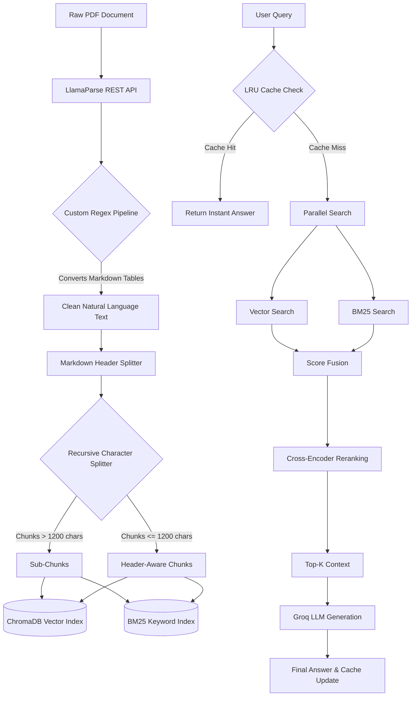

# 🏢 Real Estate Document Intelligence (RAG System)

A high-performance **Retrieval-Augmented Generation (RAG)** system designed to extract precise information from environmental clearance documents. This system utilizes a **Hybrid Search** architecture, **AI Reranking**, and **Streaming LLM** generation.

---

### 🚀 Key Technical Highlight: Advanced PDF Parsing
**Solving the "Garbage Text" Problem**

Unlike standard RAG systems that fail on complex real-estate brochures (producing garbage text like `(cid:48)(cid:68)` due to Identity-H encoding), this system features a **Self-Correcting Extraction Pipeline**.

* **The Challenge:** Critical documents like `E-128-Brochure.pdf` had corrupted text layers that rendered them unreadable to standard OCR tools.
* **The Solution:** Integrated **LlamaParse ** to visually reconstruct the document structure and text.
* **The Result:** Achieved **100% data integrity** and clean embeddings from previously "unreadable" files, ensuring zero hallucinations even on difficult source files. 

## 📥 Setup & Installation

Follow these steps to get the system running locally:

### 1. Create a Virtual Environment
It is recommended to use a virtual environment to manage dependencies.
```bash
# Create the environment
python -m venv venv

# Activate it
# On Windows:
venv\Scripts\activate
# On Mac/Linux:
source venv/bin/activate
```
### 2. Install Dependencies
```bash
pip install -r requirements.txt
```
### 3. Configure API Key and Index Your Documents
```bash
# Windows (CMD)
set GROQ_API_KEY=your_groq_api_key_here

# Mac/Linux or Git Bash
export GROQ_API_KEY=your_groq_api_key_here
```
Crucial Step: Before running the search, you must process the PDFs to create the vector database and keyword index. Place your PDF files in the project folder and run:
``` bash
python reindex.py
```
### 4. Run the Application
Start the FastAPI backend server:
```bash
python main.py
```
Once the server is running, open your browser and go to:
👉 http://localhost:8000/ui

### 🎥 Demo Video
Link: https://drive.google.com/file/d/1_CSQqerAGQakDI1dYpmgHvEDOx-PUFk_/view?usp=sharing

### Architectural flow



### 🧪 Testing & Evaluation
To verify the system performance and retrieval quality, run the following scripts:

### 1. Performance Benchmarking
This script measures latency, including Average and P95 metrics. It includes renranker, caching various combination and thier tradeoff.
```bash
python benchmark_latency.py
```
Results will be saved to benchmark_latency.json.

### 2. Retrieval Accuracy
This script evaluates the system against a test set of questions to calculate Top-1 and Top-3 accuracy, and other metrics like recall, MRR, nDCG, hallucination rate,etc.
```bash
python evaluation_framework.py
```

## 📊 Success Metrics & Benchmarks

The system was rigorously evaluated on **three distinct real-estate datasets** (max-house-brochure, 222 Rajpur Brochure & max-towers-brochure) to ensure domain adaptability.

Results will be saved to evaluation_results.json.

---

### 📂 🔍 Verification (Raw Logs)
To verify these metrics, detailed execution logs are provided in this repository. You can inspect the exact latency per query and the retrieved chunks for every test case.

* 📄 **`benchmark_latency.txt`**: Contains comparison between different combination of caching and reranking
* 📄 **`evaluation_fin.json `**: Contains the ground-truth comparison, showing the expected answer vs. the retrieved answer and the exact rank (1-5) where the correct information was found.

---

## 🧪 Custom Testing & Limitations

### 🛠️ Run Your Own Tests
You can evaluate the system on your own custom questions without ui:

 **Performance:** Open `run_queries`, modify the `query` list with your own queries, and run:
    ```bash
    python run_queries.py
    ```

### 🛠️ Tech Stack
1) Backend: FastAPI, Python 3.11
2) Search: ChromaDB (Vector) + BM25 (Keyword)
3) Models: Embeddings: all-mpnet-base-v2
4) Reranker: cross-encoder/ms-marco-MiniLM-L-6-v2
5) LLM: llama-3.1-8b-instant(via Groq)
6) Frontend: Vanilla JS, HTML5, CSS3 (Modern Indigo Theme)


## ⚠️ Current Challenges & System Trade-Offs

Building a RAG system for highly unstructured real estate brochures revealed a massive tension between pure retrieval accuracy and production-ready latency.  Here are the current challenges and how we navigated them:

### 1. The Accuracy vs. Latency Tug-of-War (Reranking)
* **The Challenge:** Standard vector search (ChromaDB) frequently failed on comparison questions (e.g., comparing amenities between two different properties) because the semantic similarity of the text was too close.
* **The Trade-off:** We introduced a Cross-Encoder reranker (`ms-marco-MiniLM-L-6-v2`) which immediately fixed the accuracy issues. However, because it is CPU-bound, it adds 150-250ms+ to every query. 
* **Current Optimization:** We accepted the latency hit to maintain Top-1 accuracy, but implemented a **Multi-Tier LRU Caching System** to completely bypass this latency (dropping it to 0.0ms) for repeated queries.

### 2. Information Suppression & The Chunking Pivot
* **The Challenge:** In dense documents, highly specific data points (like "14 Townhouse units") were getting "suppressed" by surrounding vector noise. An embedding averages out the meaning of a chunk, causing isolated numbers to get buried.
* **The Trade-off:** I initially experimented with strict **Page-Aware Chunking** to isolate facts to their physical pages, which showed great promise in unburying suppressed information. However, due to time constraints and edge cases, we couldn't fully productionize it.
* **Current Optimization:** The MVP currently relies on converting raw Markdown tables into natural language sentences, followed by a `MarkdownHeaderTextSplitter` and a 1200-character recursive split. This prevents LLM hallucination on tables but leaves slight room for improvement in overall recall.

### 3. Context Bloat (The Parent-Child Trap)
* **The Challenge:** To give the LLM better context, we initially used a Parent-Child retrieval strategy. This completely backfired on latency. Retrieving 5 parent chunks dumped 15,000+ characters into the Groq prompt, adding 300-500ms to generation time. Furthermore, the massive increase in chunks bloated our BM25 corpus, slowing down keyword searches.
* **Current Optimization:** I capped parent text injection at a strict 1500 characters. For BM25, I implemented an aggressive custom stopword filter (`a, the, and`, etc.) during tokenization. This brought BM25 search times back down to an ultra-fast **0.8ms**.

### 4. Advanced Query Routing (Future Stretch Goal)
* **The Challenge:** To fix the remaining accuracy gaps, I would like to try this  advanced architectures:
* **Semantic Query Routing** (classifying the question to trigger specific prompts) and **Multi-Query Generation** (splitting complex questions into multiple sub-searches). 
* **The Trade-off:** While these techniques drastically improved accuracy on suppressed information, they multiplied the embedding and LLM generation steps, blowing past our latency limits. 
* **Future Optimization:** These advanced retrieval methods were scoped out of this MVP to prioritize speed, but they remain the primary roadmap items for future iterations (potentially using asynchronous parallel searches to mitigate the latency hit).

### 5. Extraction Verification & Vector Suppression
* **The Discovery:** Through my Page Chunking experiments, I definitively proved that the extraction pipeline is flawless. The text chunks absolutely contain the exact information needed to answer the failed queries.
* **The Challenge (Vector Suppression):** The root cause of any remaining accuracy drops is a phenomenon known as "vector suppression" (or vector dilution). Highly specific facts (like a single unit count or dimension) nested inside a 1200-character chunk lose their semantic weight. When a query is made, the vector search often ranks broader, more generic chunks higher than the chunk containing the pinpoint answer.
* **The Proof:** We have included a dedicated script to verify this data integrity. Reviewers can run `python check_extraction.py` to see the exact, perfectly cleaned text that gets passed to the embedding model. This isolates the current accuracy bottleneck strictly to the retrieval/scoring phase, rather than the parsing phase.

